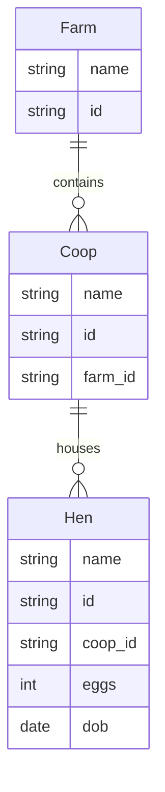

# MeshQL: Domain-Driven Service Mesh

MeshQL is a service mesh that auto-generates REST and GraphQL endpoints based on a structured domain model. It supports multiple storage backends, including MongoDB, PostgreSQL, and MySQL, and integrates seamlessly with Kafka for event-driven architectures.

## Architecture Overview

MeshQL consists of three primary components:

1. **Restlettes**: Auto-generated REST endpoints for CRUD operations.
2. **Graphlettes**: Auto-generated GraphQL endpoints with relationship resolution.
3. **Worklettes**: Asynchronous event-driven processors for background tasks.

### Core Concepts

- **Storage Backends**: Each entity can persist in MongoDB, PostgreSQL, or MySQL.
- **Temporal Querying**: Query snapshots of data at specific points in time.
- **Relationship Resolution**: Automatic dependency resolution across entities.
- **Event-Driven Processing**: Kafka-based event streams ensure scalable workflows.
- **JWT Authentication & RBAC**: Supports JWT-based authentication and CASBIN for fine-grained role-based access control.

## Configuration Generation

To configure MeshQL, start with a structured domain model:

### 1. Domain Model Definition

Define entities and relationships using a Mermaid entity-relationship diagram:



### 2. Configuration Structure

The configuration consists of storage definitions, API exposure, and event handling:

```hocon
{
  port: 3030,
  graphlettes: [ ... ],
  restlettes: [ ... ],
  worklettes: [ ... ]
}
```

### 3. Storage Configuration

Each entity is mapped to a storage backend:

```hocon
// PostgreSQL
storage = {
  type = "postgres"
  host = "localhost"
  port = 5432
  db = "farm_db"
  user = "postgres"
  password = "secret"
  table = "farms"
}

// MySQL
storage = {
  type = "mysql"
  host = "localhost"
  port = 3306
  db = "farm_db"
  user = "root"
  password = "secret"
  table = "farms"
}

// MongoDB
storage = {
  type = "mongo"
  uri = "mongodb://localhost:27017"
  db = "farm_db"
  collection = "farms"
}
```

### 4. GraphQL Configuration

Define entity relationships and GraphQL schema:

```hocon
graphlettes = [
  {
    path = "/farm/graph"
    storage = ${farmDB}
    schema = """
      type Farm {
        name: String!
        id: ID
        coops: [Coop]
      }
      
      type Query {
        getById(id: ID): Farm
        getByName(name: String): [Farm]
      }
    """
    rootConfig {
      singletons = [
        {
          name = "getById"
          query = "id = '{{id}}'"  // SQL/Postgres/MySQL
        }
      ]
      resolvers = [
        {
          name = "coops"
          queryName = "getByFarm"
          url = "http://localhost:3030/coop/graph"
        }
      ]
    }
  }
]
```

### 5. REST Configuration

Expose entity CRUD operations via REST:

```hocon
restlettes = [
  {
    path = "/farm/api"
    storage = ${farmDB}
    schema = {
      type = "object"
      properties = {
        name = { type = "string" }
        id = { type = "string" }
      }
      required = ["name"]
    }
  }
]
```

### 6. Worklettes (Event Processing)

MeshQL integrates with Kafka to enable **event-driven workflows**:

```hocon
worklettes = [
  {
    topic = "farm-events"
    storage = ${farmDB}
    handler = "com.example.FarmEventProcessor"
  }
]
```

## Example: Converting Domain Model to Configuration

1. Define the **domain model** using Mermaid.
2. Configure **storage** for each entity.
3. Create **GraphQL & REST schemas** for query & CRUD operations.
4. Implement **Worklettes** for event-driven processing.
5. Configure **authentication & authorization**.

MeshQL will automatically:
- Generate REST & GraphQL endpoints
- Process **temporal queries**
- Sync data **across multiple storage backends**
- Enable event-driven **asynchronous processing**
- Manage **authentication & authorization**

## Testing Your Configuration

Use automated tests to validate the configuration:

```typescript
describe("The Domain", () => {
  it("should build a service mesh with multiple entities", async () => {
    const query = `{
      getById(id: "${entityId}") {
        name
        coops {
          name
        }
      }
    }`;

    const json = await callSubgraph(
      new URL(`http://localhost:${port}/farm/graph`),
      query,
      "getById",
      `Bearer ${token}`
    );

    expect(json.name).toBe("Expected");
    expect(json.coops).toHaveLength(expected);
  });
});
```

## Getting Started

1. Install dependencies:
```bash
yarn install
```

2. Create a configuration file:
```bash
cp config/config.example.conf config/config.conf
```

3. Start the server:
```bash
yarn start
```

For full documentation, see the `packages/meshql/test/config` directory.
