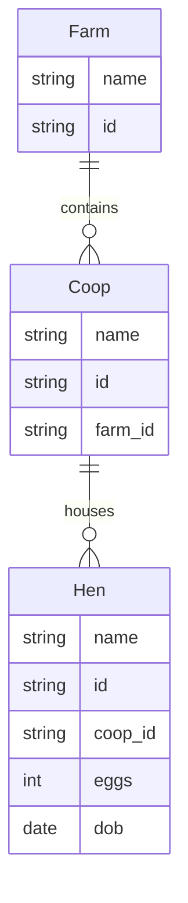

# MeshQL: Domain-Driven Service Mesh

MeshQL is a service mesh that auto-generates REST and GraphQL endpoints based on a structured domain model. It supports multiple storage backends and integrates with event-driven architectures.

## Architecture Overview

MeshQL consists of three primary components:

1. **Restlettes**: Auto-generated REST endpoints for CRUD operations
2. **Graphlettes**: Auto-generated GraphQL endpoints with relationship resolution
3. **Worklettes**: Asynchronous event-driven processors (implemented by the app, not the libary)

### Core Features

- **Multiple Storage Backends**:
  - MongoDB: Document-based storage with native JSON support
  - PostgreSQL: ACID-compliant relational database with JSON capabilities
  - MySQL: High-performance relational database with JSON support
  - SQLite: Lightweight embedded database for development/testing
  
- **Temporal Querying**: Query data at specific points in time using timestamps
  - Millisecond precision in MongoDB and SQLite
  - Configurable precision in PostgreSQL/MySQL
  
- **Authentication & Authorization**:
  - JWT-based authentication with subject extraction
  - Fine-grained access control via authorized_tokens
  - CASBIN support for role-based access control (RBAC)

- **GraphQL Features**:
  - Automatic relationship resolution
  - Temporal queries via timestamp arguments
  - Subgraph federation

## Configuration

### 1. Domain Model

Define your domain using Mermaid ER diagrams:



### 2. Storage Configuration

Configure your preferred storage backend:

```hocon
// PostgreSQL Example
storage = {
  type = "postgres"
  host = "localhost"
  port = 5432
  db = "farm_db"
  user = "postgres"
  password = "secret"
  table = "farms"
}

// MySQL Example
storage = {
  type = "mysql"
  host = "localhost"
  port = 3306
  db = "farm_db"
  user = "root"
  password = "secret"
  table = "farms"
}

// MongoDB Example
storage = {
  type = "mongo"
  uri = "mongodb://localhost:27017"
  db = "farm_db"
  collection = "farms"
  options = {
    directConnection = true
  }
}

// SQLite Example (for development)
storage = {
  type = "sql"
  uri = "./dev.db"
  collection = "farms"
}
```

### 3. API Configuration

Define your GraphQL schema and resolvers:

```hocon
graphlettes = [
  {
    path = "/farm/graph"
    storage = ${farmDB}
    schema = """
      type Farm {
        name: String!
        id: ID
        coops: [Coop]
      }
      
      type Query {
        getById(id: ID, at: Float): Farm        # 'at' enables temporal queries
        getByName(name: String): [Farm]
      }
    """
    rootConfig {
      singletons = [
        {
          name = "getById"
          query = "id = '{{id}}'"
        }
      ]
      resolvers = [
        {
          name = "coops"
          queryName = "getByFarm"
          url = "http://localhost:3030/coop/graph"
        }
      ]
    }
  }
]
```

Configure REST endpoints:

```hocon
restlettes = [
  {
    path = "/farm/api"
    storage = ${farmDB}
    schema = {
      type = "object"
      properties = {
        name = { type = "string" }
        id = { type = "string" }
      }
      required = ["name"]
    }
  }
]
```

## Development

### Prerequisites
- Node.js 18+
- Yarn
- Docker (for running tests)

### Setup
```bash
# Install dependencies
yarn install

# Copy example config
cp config/config.example.conf config/config.conf

# Build all packages
yarn build

# Run tests
yarn test
```

### Testing
MeshQL uses container-based testing for database integrations:
- PostgreSQL tests via testcontainers
- MySQL tests with containerized MySQL 8.0
- MongoDB tests with mongodb-memory-server
- SQLite tests with in-memory database

## API Documentation

Auto-generated OpenAPI documentation is available at `/docs` when running the server.

For detailed GraphQL documentation, visit the GraphQL playground at `/graphql`.
