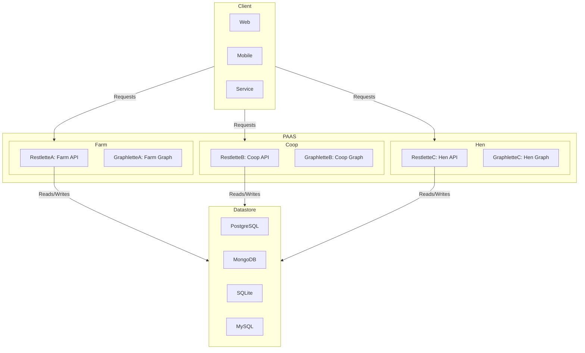
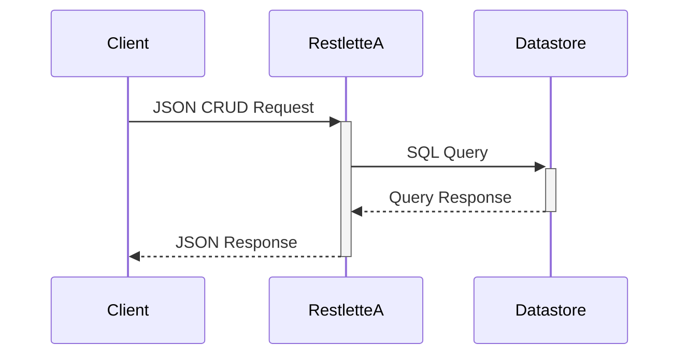
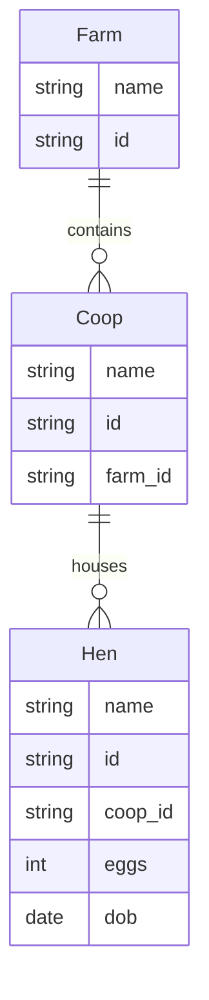

# MeshQL: Domain-Driven Service Mesh

MeshQL is a service mesh that auto-generates REST and GraphQL endpoints based on a structured domain model. It supports multiple storage backends and integrates with event-driven architectures.

## Component Overview



## Core Packages

MeshQL is composed of several key packages, each serving a specific purpose:

### Main Packages

- [@meshobj/cli](packages/cli/README.md) - Command-line interface for running and configuring MeshQL servers
- [@meshobj/server](packages/server/README.md) - Core server implementation with GraphQL and REST support
- [@meshobj/merminator](packages/merminator/README.md) - Configuration generator from Mermaid diagrams

### Database Plugins

- [@meshobj/mongo_repo](packages/mongo_repo/README.md) - MongoDB integration
- [@meshobj/postgres_repo](packages/postgres_repo/README.md) - PostgreSQL integration
- [@meshobj/mysql_repo](packages/mysql_repo/README.md) - MySQL integration
- [@meshobj/sqlite_repo](packages/sqlite_repo/README.md) - SQLite integration

### API Components

- [@meshobj/graphlette](packages/graphlette/README.md) - GraphQL endpoint generator and resolver
- [@meshobj/restlette](packages/restlette/README.md) - REST API endpoint generator

### Authentication & Authorization

- [@meshobj/jwt_auth](packages/jwt_auth/README.md) - JWT-based authentication
- [@meshobj/casbin_auth](packages/casbin_auth/README.md) - CASBIN-based authorization

## Basic Operation Flow



## Core Features

- **Multiple Storage Backends**:
    - MongoDB: Document-based storage with native JSON support
    - PostgreSQL: ACID-compliant relational database with JSON capabilities
    - MySQL: High-performance relational database with JSON support
    - SQLite: Lightweight embedded database for development/testing
- **Temporal Querying**: Query data at specific points in time using timestamps
- **Authentication & Authorization**:
    - JWT-based authentication with subject extraction
    - Fine-grained access control via authorized_tokens
    - CASBIN support for role-based access control (RBAC)
- **GraphQL Features**:
    - Automatic relationship resolution
    - Temporal queries via timestamp arguments
    - Subgraph federation

## Configuration

### 1. Domain Model

Define your domain using Mermaid class diagrams:



### 2. Storage Configuration

Configure your preferred storage backend:

```hocon
storage = {
  type = "postgres"  // or "mysql", "mongo", "sql"
  uri = "connection_string"
  collection = "collection_name"
}
```

For detailed configuration options, see the respective database plugin READMEs.

### 3. API Configuration

For detailed API configuration examples, see the [@meshobj/server documentation](packages/server/README.md).

## Development

### Prerequisites

- Node.js 18+
- Yarn
- Docker (for running tests)

### Setup

```bash
# Install dependencies
yarn install

# Copy example config
cp config/config.example.conf config/config.conf

# Build all packages
yarn build

# Run tests
yarn test
```

### Testing

MeshQL uses container-based testing for database integrations:

- PostgreSQL tests via testcontainers
- MySQL tests with containerized MySQL 8.0
- MongoDB tests with mongodb-memory-server
- SQLite tests with in-memory database

## API Documentation

Auto-generated OpenAPI documentation is available at `/docs` when running the server.

For detailed GraphQL documentation, visit the GraphQL playground at `/graphql`.

## License

MIT

## Author

Tom Marsh
