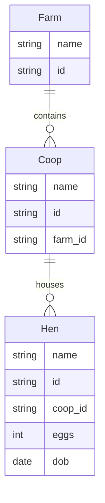

# MeshQL: Domain-Driven Service Mesh

MeshQL is a powerful service mesh that automatically generates REST and GraphQL endpoints from your domain model. It's designed to be easily configurable and supports multiple storage backends including MongoDB, SQLite, and PostgreSQL.

## Architecture Overview

MeshQL consists of two main components:

1. **Restlettes**: Auto-generated REST endpoints that provide CRUD operations for your domain entities
2. **Graphlettes**: Auto-generated GraphQL endpoints that provide query capabilities with relationship resolution

### Core Concepts

- **Storage Backends**: Each entity can be stored in MongoDB, SQLite, or PostgreSQL
- **Temporal Querying**: Built-in support for querying data at specific points in time
- **Relationship Resolution**: Automatic resolution of relationships between entities
- **JWT Authentication**: Built-in support for JWT-based authentication
- **RBAC Authorization**: Optional CASBIN-based role-based access control

## Configuration Generation

To generate a configuration from a domain model, you need to understand the following components:

### 1. Domain Model Definition

Start with a Mermaid diagram that defines your entities and their relationships. For example:



### 2. Configuration Structure

The configuration consists of two main sections:

```hocon
{
  port: 3030,
  graphlettes: [ ... ],
  restlettes: [ ... ]
}
```

### 3. Storage Configuration

For each entity, define its storage configuration. Examples for different backends:

```hocon
// MongoDB
storage = {
  type = "mongo"
  uri = "mongodb://localhost:27017"
  db = "farm_db"
  collection = "farms"
}

// PostgreSQL
storage = {
  type = "postgres"
  host = "localhost"
  port = 5432
  db = "farm_db"
  user = "postgres"
  password = "secret"
  table = "farms"
}

// SQLite
storage = {
  type = "sql"
  uri = ":memory:"
  collection = "farms"
}
```

### 4. GraphQL Configuration

For each entity, define its GraphQL schema and resolvers:

```hocon
graphlettes = [
  {
    path = "/farm/graph"
    storage = ${farmDB}
    schema = """
      type Farm {
        name: String!
        id: ID
        coops: [Coop]
      }
      
      type Query {
        getById(id: ID): Farm
        getByName(name: String): [Farm]
      }
    """
    rootConfig {
      singletons = [
        {
          name = "getById"
          query = "{\"id\": \"{{id}}\"}"  // MongoDB
          // query = "id = '{{id}}'"      // SQL/Postgres
        }
      ]
      resolvers = [
        {
          name = "coops"
          queryName = "getByFarm"
          url = "http://localhost:3030/coop/graph"
        }
      ]
    }
  }
]
```

### 5. REST Configuration

For each entity, define its REST endpoints:

```hocon
restlettes = [
  {
    path = "/farm/api"
    storage = ${farmDB}
    schema = {
      type = "object"
      properties = {
        name = { type = "string" }
        id = { type = "string" }
      }
      required = ["name"]
    }
  }
]
```

## Example: Converting Domain Model to Configuration

Given a domain model like the Farm example above:

1. Create a storage configuration for each entity
2. Generate GraphQL schemas with appropriate types and queries
3. Define resolvers for relationships (e.g., Farm -> Coops -> Hens)
4. Create REST endpoints with JSON schemas
5. Configure authentication and authorization if needed

The system will automatically:
- Generate CRUD REST endpoints
- Create GraphQL queries with relationship resolution
- Handle temporal queries with the `at` parameter
- Manage data persistence in your chosen storage backend
- Apply authentication and authorization rules

## Testing Your Configuration

Use the certification test pattern to verify your configuration:

```typescript
describe("The Domain", () => {
  it("should build a server with multiple nodes", async () => {
    const query = `{
      getById(id: "${entityId}") {
        name
        relationships {
          name
        }
      }
    }`;

    const json = await callSubgraph(
      new URL(`http://localhost:${port}/entity/graph`),
      query,
      "getById",
      `Bearer ${token}`
    );

    expect(json.name).toBe("Expected");
    expect(json.relationships).toHaveLength(expected);
  });
});
```

## Security Considerations

1. Always use environment variables for sensitive configuration
2. Configure CORS appropriately for your environment
3. Use HTTPS in production
4. Implement appropriate rate limiting
5. Configure authentication and authorization

## Getting Started

1. Install dependencies:
```bash
yarn install
```

2. Create your configuration file:
```bash
cp config/config.example.conf config/config.conf
```

3. Start the server:
```bash
yarn start
```

For more examples and detailed documentation, see the `packages/meshql/test/config` directory.
