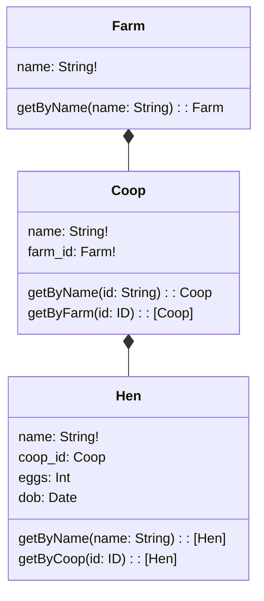

# @meshobj/merminator

A configuration generator that transforms Mermaid class diagrams into meshobj server configurations, making it easier to set up and maintain complex API meshes.

## Overview

Merminator simplifies the process of configuring meshobj servers by allowing you to define your data model and relationships using Mermaid class diagrams. It automatically generates:

- GraphQL schemas
- JSON schemas for REST endpoints
- Server configurations for both GraphQL and REST APIs
- Repository configurations
- Query resolvers
- Relationship mappings

## Installation

```bash
npm install @meshobj/merminator
# or
yarn add @meshobj/merminator
```

## Usage

### Basic Example

Define your data model using a Mermaid class diagram:



### Syntax Guide

#### 1. Relationships

Use `*--` to define parent-child relationships:
```mermaid
ParentEntity *-- ChildEntity
```

This will:
- Create appropriate foreign key fields
- Set up GraphQL resolvers
- Configure reverse lookups

#### 2. Fields

Define fields using the format: `fieldName: Type!`

- Basic types: `String`, `Int`, `Float`, `Boolean`, `Date`, `ID`
- Required fields: Add `!` suffix (e.g., `name: String!`)
- References: Use entity names as types (e.g., `farm_id: Farm`)
- Arrays: Use square brackets (e.g., `items: [String]`)

#### 3. Queries

Define queries using GraphQL-style syntax:
```
getByField(field: Type): ReturnType
```

Common query patterns:
- `getById(id: ID): Entity`
- `getByName(name: String): Entity`
- `getByParent(id: ID): [Entity]`

All queries automatically support an optional `at: Float` parameter for temporal queries.

### Conventions

1. **ID References**: Use `entity_id` naming for foreign key fields
   ```
   farm_id: Farm!  // References a Farm entity
   ```

2. **Reverse Lookups**: Parent-child relationships automatically create collection fields
   ```
   Farm *-- Coop  // Adds coops: [Coop] to Farm
   ```

3. **Required Fields**: Use `!` to mark required fields
   ```
   name: String!  // Required field
   ```

## Generated Output

Merminator generates:

1. **GraphQL Schema**
   - Entity types
   - Query definitions
   - Relationship fields

2. **JSON Schema**
   - Entity validation
   - Required fields
   - Type mappings

3. **Server Configuration**
   - Repository settings
   - Query resolvers
   - Relationship mappings

## Integration with meshobj

The generated configurations can be used directly with `@meshobj/cli`:

```typescript
import { generateConfig } from '@meshobj/merminator';
import { startServer } from '@meshobj/cli';

const mermaidDiagram = `...`;
const config = generateConfig(mermaidDiagram);
const app = await startServer(config);
```

## License

MIT

## Author

Tom Marsh